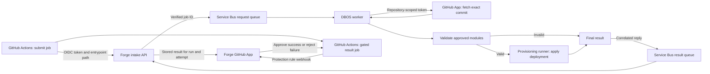

# Forge

Bun workspaces for apps in `02_Apps/*` and libraries in `03_Libraries/*`.
Each package should have its own `package.json`. Use `workspace:*` for dependencies between local packages.

The Forge SSR app lives in [`02_Apps/forge`](02_Apps/forge/README.md).
For the local Docker stack, see [`04_Infrastructure/local`](04_Infrastructure/local/README.md).
Copy `.env.example` to `.env`, set the secrets, then run `just up` from the
repository root.

The project-creation vertical slice is described in [docs/project-provisioning.md](docs/project-provisioning.md). Azure resource and sub-resource designations are registered in [docs/resource-designations.md](docs/resource-designations.md).

## Infrastructure layout

```text
04_Infrastructure/
  catalog/
    bicep/           # Approved Bicep modules, published to Azure Container Registry
    terraform/       # Approved Terraform modules
  platform/
    bootstrap/       # First-time setup, including Azure CLI scripts
    bicep/           # Infrastructure that runs Forge itself
  local/             # Docker Compose stack for local development and debugging
```

`catalog` is the source of truth for modules that customer deployments may use.
Each module gets its own directory. Bicep modules are published to Azure Container
Registry. Terraform modules can initially be consumed from version-pinned Git
paths; a private Terraform module registry can be added when needed. `platform`
is for Forge's own infrastructure and may use resources outside the catalog.
The execution app lives in [`02_Apps/forge.provisioner`](02_Apps/forge.provisioner/README.md).
Its TypeScript executor, Azure and GitHub handlers, task catalog, and Bicep templates
are packaged into the container at build time. DBOS pins the image ID for each
attempt. See [the runner design](docs/container-job-runners.md) and
[credential setup](docs/project-provisioning.md). Admins inspect task configuration,
image IDs, parameters, and logs in Forge.

## Customer deployment flow

The planned GitHub Actions workflow submits a Bicep or Terraform entrypoint path to
Forge, then waits at a GitHub environment gate. Forge verifies the job's GitHub
OIDC token, checks that its repository and workflow are allowed, and resolves the
source commit from the verified workflow run. The repository and commit supplied
by a caller are not trusted on their own.



The intake API records the verified repository ID, workflow run ID, run attempt,
commit, and entrypoint path before publishing the job ID. DBOS uses that ID for
idempotent processing and returns a correlated final result. The GitHub App matches
the pending protection rule to the same run and attempt before approving or
rejecting it. The gated job is not assigned a runner while it waits. GitHub's
custom deployment protection rules are currently in public preview and require
GitHub Enterprise for private or internal repositories.

Validation must check module references and their dependencies, require approved
immutable module versions, and reject direct resource definitions that bypass the
approved modules. This deployment flow is a design; the API, queue integration,
DBOS workflow, and GitHub App are not implemented yet.

## Development commands

```sh
bun install
bun run build
bun run dev
bun run test
bun run typecheck
bun run check
bun run format
bun run ci
```

`check` runs Biome's format and lint checks without writing files. `format` writes formatting changes. `ci` checks formatting and linting, runs package type checks and tests, then builds. Turbo runs package scripts for builds, development, tests, and type checks.
